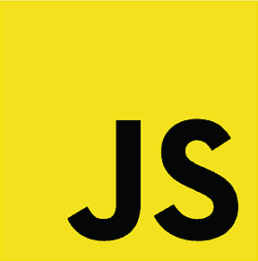
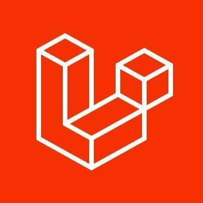
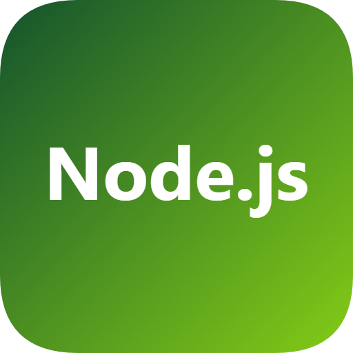
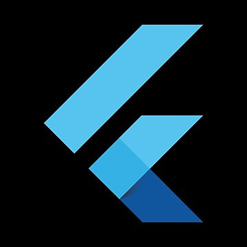
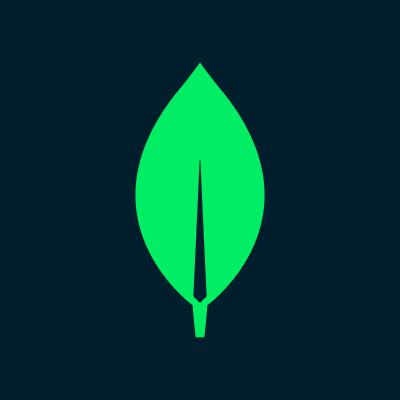

 

# Mohamed AMINE MENASRIA

### Software Engineer

Building enterprise full-stack systems, reusable frontend architecture, and production-grade applications.

 

 
 

---

## About

I work at the intersection of **frontend architecture** and **backend systems engineering**.

My focus is building production-grade platforms where user experience, system architecture, safety constraints, and measurable product impact all need to work together.

Currently Working with Basikon, a French fintech company, building enterprise platforms and scalable digital experiences

---

## Tech I work with

  
  &nbsp;&nbsp;
  
  &nbsp;&nbsp;
  
  &nbsp;&nbsp;
   
  &nbsp;&nbsp;
  
  &nbsp;&nbsp;
  
  &nbsp;&nbsp;
  
  &nbsp;&nbsp;
  
 &nbsp;&nbsp;
   

  
    JavaScript • React • TypeScript • Flutter • Google Maps • NodeJs • Laravel • MongoDB • Vue.Js •
  

---

## Current focus

<table>
  <tr>
    <td width="50%">
      <h3>Frontend Architecture</h3>
      
Reusable UI libraries, scalable NextJs/React Or VueJs applications, design systems, and enterprise frontend patterns.

    </td>
  </tr>
  <tr>
    <td width="50%">
      <h3>Product Platforms</h3>
      
Business applications, workflow systems, operational dashboards, role-based platforms, and reliable enterprise software.

    </td>
    <td width="50%">
      <h3>Data & Visualization</h3>
      
Geospatial dashboards, live tracking, interactive maps, data visualization, and interfaces that turn complex data into actionable insights.

    </td>
  </tr>
</table>

---

## Selected impact

| Area | Verified impact |
|---|---|
| Experience | **6+ years** in software engineering |
| Delivery | **7 enterprise projects** delivered |
| International exposure | Professional experience with a French fintech company|
| Computer Vision | Master's degree and professional background in Computer Vision & Image Processing |

---

## Stack by capability

| Capability | Tools & technologies |
|---|---|
| **Frontend Architecture** | React, Vue, TypeScript, Flutter, Dart, RxJS, SCSS, reusable libraries |
| **Backend Integration** | Laravel , NodeJs, REST APIs, microservices architecture, secure API integration |
| **Data & Visualization** | ECharts, Leaflet, Chart.js, geospatial dashboards, operational maps, Power BI integrations |
| **Product Engineering** | enterprise UI, responsive systems, accessibility, maintainability, production delivery |

---

## Portfolio

My portfolio presents my work, technical direction, case studies, verified impact, recommendations, and CV.

---

## What I care about

- Architecture before implementation
- User experience before visual noise
- Safety and reliability before shiny features
- Production constraints before demos
- Maintainable systems before clever code
- Measurable impact before vanity metrics

---

## Connect

---

### Building systems where frontend architecture meets intelligent vision.

